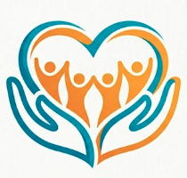

<div align="center">

  

# DonasiKita

**Platform Donasi & Penggalangan Dana berbasis web**

[](https://php.net)
[](https://laravel.com)
[](https://tailwindcss.com)
[](https://alpinejs.dev)
[](LICENSE)

</div>

## Daftar Isi

- [Tentang](#tentang)
- [Fitur](#fitur)
- [Tech Stack](#tech-stack)
- [Struktur Proyek](#struktur-proyek)
- [Prasyarat](#prasyarat)
- [Instalasi & Setup](#instalasi--setup)
- [Konfigurasi](#konfigurasi)
- [Menjalankan Aplikasi](#menjalankan-aplikasi)
- [Script Tersedia](#script-tersedia)
- [Testing](#testing)
- [Screenshot](#screenshot)
- [Tim Pengembang](#tim-pengembang)

## Tentang

**DonasiKita** adalah platform penggalangan dana (crowdfunding) berbasis web yang memungkinkan individu atau organisasi membuat campaign sosial untuk mengumpulkan donasi dari masyarakat. Tersedia kategori campaign seperti Pendidikan, Kesehatan, Bencana, dan Sosial.

Proyek ini dikembangkan sebagai tugas kelompok mata kuliah berbasis Laravel dengan sistem kolaborasi Git.

## Fitur

### Publik

- **Beranda** — Menampilkan statistik total donasi, jumlah donatur, campaign aktif, kategori, campaign unggulan, dan testimoni.
- **Daftar Campaign** — Menampilkan semua campaign dengan informasi progress, jumlah donor, kategori, dan status.
- **Detail Campaign** — Menampilkan informasi lengkap campaign, daftar donasi, komentar, dan form donasi.
- **Tentang** — Profil tim pengembang.

### Autentikasi

- Registrasi akun baru (nama, email, password).
- Login/Logout dengan session-based authentication.
- Proteksi halaman tertentu untuk pengguna terautentikasi.

### Campaign (CRUD)

- **Buat Campaign** — Pengguna terautentikasi dapat membuat campaign baru (judul, kategori, target donasi, deskripsi, batas waktu, gambar sampul).
- **Edit Campaign** — Pemilik campaign dapat memperbarui detail dan status campaign.
- **Hapus Campaign** — Pemilik campaign dapat menghapus campaign beserta gambar sampul.
- Status campaign: `draft`, `active`, `completed`, `cancelled`.

### Donasi

- Donasi dengan nominal minimal Rp 1.000.
- Opsi donasi anonim.
- Pesan dukungan opsional.
- Progress campaign (target, terkumpul, persentase) diperbarui otomatis.

### Komentar

- Pengguna terautentikasi dapat menambahkan komentar pada campaign.

### Dashboard Pengguna

- Ringkasan jumlah campaign yang dibuat, donasi terbaru, dan status campaign aktif.

## Tech Stack

| Layer               | Teknologi                                            |
| ------------------- | ---------------------------------------------------- |
| **Backend**         | PHP 8.4, Laravel 13                                  |
| **Frontend**        | Blade, Tailwind CSS 4, Alpine.js 3.15                |
| **Bundler**         | Vite 8 + `@tailwindcss/vite` + `laravel-vite-plugin` |
| **Database (dev)**  | PostgreSQL                                           |
| **Database (test)** | SQLite :memory:                                      |
| **Testing**         | Pest 4, PHPUnit                                      |
| **Code Style**      | Laravel Pint                                         |
| **Icons**           | Blade Heroicons (`blade-ui-kit/blade-heroicons`)     |
| **Logs**            | Laravel Pail                                         |
| **Dev Server**      | Concurrently                                         |

## Struktur Proyek

```
├── app/
│   ├── Http/
│   │   └── Controllers/
│   │       ├── AboutController.php       # Halaman tentang
│   │       ├── AuthController.php        # Register, login, logout
│   │       ├── CampaignController.php    # CRUD campaign, donasi, komentar
│   │       ├── Controller.php            # Abstract base (kosong)
│   │       ├── DashboardController.php   # Dashboard user
│   │       └── HomeController.php        # Halaman beranda
│   ├── Models/
│   │   ├── Campaign.php
│   │   ├── Comment.php
│   │   ├── Donation.php
│   │   └── User.php
│   └── Providers/
│       └── AppServiceProvider.php
├── bootstrap/
│   └── app.php                            # Konfigurasi routing & middleware
├── config/
│   ├── app.php, auth.php, cache.php, ...
│   ├── brand.php                          # Brand, kategori, warna
│   └── navigation.php                     # Menu navbar
├── database/
│   ├── factories/
│   │   ├── CampaignFactory.php
│   │   └── UserFactory.php
│   ├── migrations/
│   │   ├── 0001_01_01_000000_create_users_table.php
│   │   ├── 0001_01_01_000001_create_cache_table.php
│   │   ├── 0001_01_01_000002_create_jobs_table.php
│   │   ├── 2026_06_24_060803_create_campaigns_table.php
│   │   ├── 2026_06_24_060844_create_donations_table.php
│   │   └── 2026_06_24_060859_create_comments_table.php
│   └── seeders/
│       └── DatabaseSeeder.php
├── resources/
│   ├── css/
│   │   └── app.css                        # Tailwind import + base layer
│   ├── js/
│   │   └── app.js                         # Alpine.js bootstrap
│   └── views/
│       ├── components/
│       │   ├── footer.blade.php
│       │   ├── layout.blade.php
│       │   └── navbar.blade.php
│       ├── about/
│       │   ├── index.blade.php
│       │   └── team-card.blade.php
│       ├── auth/
│       │   ├── login.blade.php
│       │   └── register.blade.php
│       ├── campaigns/
│       │   ├── create.blade.php
│       │   ├── edit.blade.php
│       │   ├── index.blade.php
│       │   └── show.blade.php
│       ├── dashboard/
│       │   └── index.blade.php
│       └── home/
│           └── index.blade.php
├── routes/
│   └── web.php                            # Semua route web
├── storage/
│   └── app/public/                        # Upload gambar campaign
├── tests/
│   ├── Feature/
│   │   ├── CampaignTest.php
│   │   └── DashboardTest.php
├── composer.json
├── package.json
├── vite.config.js
└── phpunit.xml
```

## Prasyarat

- PHP 8.4+
- Composer 2.x
- Node.js 20+ & npm
- PostgreSQL (development) atau SQLite (testing)
- Ekstensi PHP: `pdo_pgsql`, `pdo_sqlite`, `gd` atau `imagick` (untuk upload gambar)

## Instalasi & Setup

### 1. Clone repositori

```bash
git clone <url-repository>
cd asn-laravel
```

### 2. Install dependensi PHP

```bash
composer install
```

### 3. Install dependensi frontend

```bash
npm install
```

### 4. Konfigurasi environment

```bash
cp .env.example .env
php artisan key:generate
```

Sesuaikan konfigurasi database di `.env` (lihat [Konfigurasi](#konfigurasi)).

### 5. Setup database

```bash
php artisan migrate
```

(Opsional) Buat symlink storage:

```bash
php artisan storage:link
```

### 6. Build aset frontend

```bash
npm run build
```

### Setup cepat (alternatif)

```bash
composer run setup
```

Perintah di atas menjalankan `composer install`, membuat `.env` jika belum ada, generate key, migrate, `npm install`, dan `npm run build` secara berurutan.

## Konfigurasi

### `.env`

| Variabel           | Default                 | Deskripsi                                      |
| ------------------ | ----------------------- | ---------------------------------------------- |
| `APP_NAME`         | `Laravel`               | Nama aplikasi                                  |
| `APP_ENV`          | `local`                 | Environment (`local`, `production`, `testing`) |
| `APP_DEBUG`        | `true`                  | Mode debug                                     |
| `APP_URL`          | `http://localhost:8000` | Base URL aplikasi                              |
| `DB_CONNECTION`    | `pgsql`                 | Driver database (`pgsql`, `mysql`, `sqlite`)   |
| `DB_HOST`          | `127.0.0.1`             | Host database                                  |
| `DB_PORT`          | `5432`                  | Port database                                  |
| `DB_DATABASE`      | `asn_laravel`           | Nama database                                  |
| `DB_USERNAME`      | —                       | Username database                              |
| `DB_PASSWORD`      | —                       | Password database                              |
| `FILESYSTEM_DISK`  | `local`                 | Disk penyimpanan file                          |
| `SESSION_DRIVER`   | `file`                  | Driver session                                 |
| `QUEUE_CONNECTION` | `sync`                  | Koneksi queue                                  |

### Database

- **Development:** PostgreSQL. Konfigurasi di `.env` sesuai environment lokal masing-masing.
- **Testing:** SQLite in-memory (diatur otomatis oleh `phpunit.xml`).
- Migrasi dijalankan dengan `php artisan migrate`.

### Storage

Gambar sampul campaign disimpan di `storage/app/public/campaigns/` dengan disk `public`. Jalankan `php artisan storage:link` untuk membuat symlink `public/storage` → `storage/app/public`.

### Queue

Konfigurasi queue default adalah `sync` (synchronous). Untuk production, ubah `QUEUE_CONNECTION` di `.env` menjadi `database` atau `redis`, lalu jalankan queue worker:

```bash
php artisan queue:work
```

## Menjalankan Aplikasi

### Development (local)

```bash
composer run dev
```

Perintah ini menjalankan 4 proses secara bersamaan:

1. **server** — `php artisan serve` (http://localhost:8000)
2. **queue** — `php artisan queue:listen`
3. **logs** — `php artisan pail` (live log viewer)
4. **vite** — `npm run dev` (HMR untuk aset frontend)

### Development (network)

```bash
composer run dev-host
```

Sama seperti di atas tetapi server dan Vite dapat diakses dari perangkat lain dalam jaringan yang sama (0.0.0.0).

### Production

```bash
npm run build
```

Kemudian jalankan Laravel melalui web server (Nginx/Apache) yang mengarah ke folder `public/`, atau gunakan Laravel Cloud / Fly.io / Render.

## Script Tersedia

### Composer

| Perintah                | Deskripsi                                       |
| ----------------------- | ----------------------------------------------- |
| `composer run dev`      | Jalankan server dev, queue, logs, dan Vite      |
| `composer run dev-host` | Sama seperti `dev` tetapi bind ke 0.0.0.0       |
| `composer run test`     | Jalankan test suite                             |
| `composer run setup`    | Setup lengkap project baru                      |
| `composer run pint`     | Format kode dengan Laravel Pint (jika diinstal) |

### npm

| Perintah        | Deskripsi                      |
| --------------- | ------------------------------ |
| `npm run dev`   | Jalankan Vite dev server (HMR) |
| `npm run build` | Build aset untuk production    |

## Testing

Testing menggunakan **Pest 4** dengan SQLite in-memory.

```bash
composer run test
```

Atau tanpa config clear:

```bash
php artisan test
```

### Test yang tersedia

| File                              | Deskripsi                                                   |
| --------------------------------- | ----------------------------------------------------------- |
| `tests/Feature/CampaignTest.php`  | Test donasi memperbarui progress campaign |
| `tests/Feature/DashboardTest.php` | Test akses dashboard user                 |

**Catatan:** Masih banyak fitur yang belum memiliki test (CRUD campaign, autentikasi, komentar).

## Screenshot

<!-- TODO: Tambahkan screenshot aplikasi -->

| Halaman         | Screenshot       |
| --------------- | ---------------- |
| Beranda         | _Belum tersedia_ |
| Daftar Campaign | _Belum tersedia_ |
| Detail Campaign | _Belum tersedia_ |
| Dashboard       | _Belum tersedia_ |
| Login           | _Belum tersedia_ |
| Register        | _Belum tersedia_ |

> Screenshot dapat ditambahkan dengan menyimpan gambar ke folder `public/screenshots/` dan menggunakan markup ``.

## Tim Pengembang

| Nama                        | NIM       | Role    | Tugas     |
| --------------------------- | --------- | ------- | --------- |
| Ferdiyansyah Pratama Putra  | 241110117 | Ketua   | Team Lead |
| Muhammad Fathurrahman       | 241110109 | Anggota | Frontend  |
| Maria Violeta V. Wungubelen | 241110105 | Anggota | Backend   |
| Enrico Reyner Lumenta       | 241110093 | Anggota | Backend   |
| Julius Flaviano Aleo Keu    | 241110082 | Anggota | Frontend  |

---

Proyek ini dikembangkan sebagai tugas kelompok mata kuliah pemrograman web berbasis framework.
